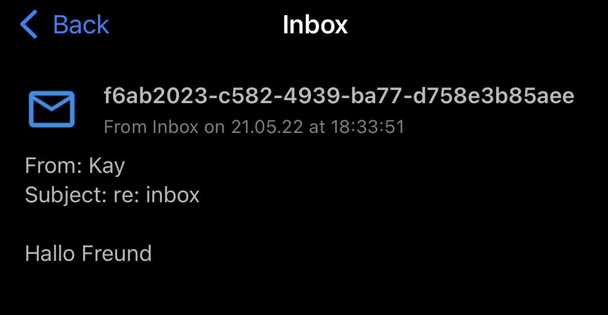

# inbox

Inbox is a simple upload server with [Pushover](https://pushover.net/) notification.

``` bash
echo "Hallo Freund" | \
  curl -F file=@- -F "from=Kay" -F "subject=re: inbox" http://localhost:25478/inbox
```

Persist upload to disk.  

`./data/f6ab2023-c582-4939-ba77-d758e3b85aee`

``` json
{
  "time":"2022-05-21T18:33:51.562755+02:00",
  "id":"f6ab2023-c582-4939-ba77-d758e3b85aee",
  "from":"Kay",
  "subject":"re: inbox",
  "payload":"SGFsbG8gRnJldW5kCg=="
}

```

With optional Pushover notification.  



## Use case

### Upload a file

```bash
curl -F "file=@msg.txt" -F "from=Kay" -F "subject=file upload" https://127.0.0.1:12345/inbox
```

### Upload encrypted message

I prefer [age](https://github.com/FiloSottile/age) instead of pgp.

``` bash
echo "Hallo Freund" | \
  age -r age1tjup7hvt35ldu3n98kzfl8ckl6dm43s4wnr02vrx7vvw27njhv4qfgdwym -a -o - | \
  curl -F file=@- -F "from=Kay" -F "subject=encrypted message" http://localhost:25478/inbox

``` 


## Install

```bash
git clone https://github.com/kernelschmelze/inbox.git
cd inbox
go build
```

## Usage

``` bash
./inbox -f inbox.toml
```

## Config

`inbox.toml`  

``` toml

# 25478
# :25478
# http://127.0.0.1:25478
# https://127.0.0.1:25478

listen = ":25478"

# tls crt and key file

crt = "srv.crt"
key = "srv.key"

# pushover config

[pushover]
  app = "API Token"
  user = "Your User Key"
  
```

